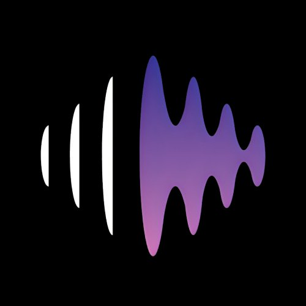
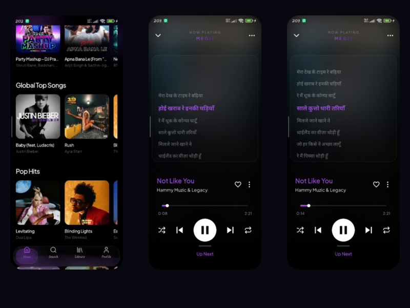
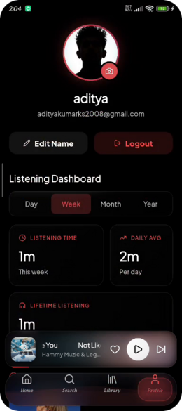
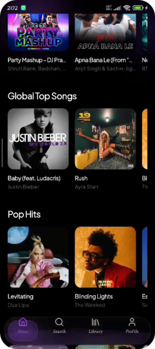
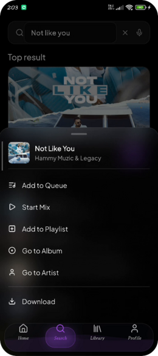
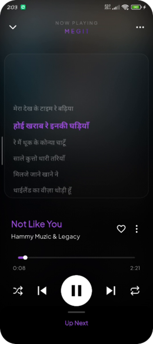
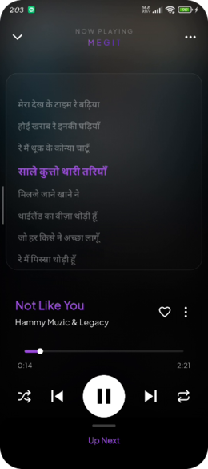
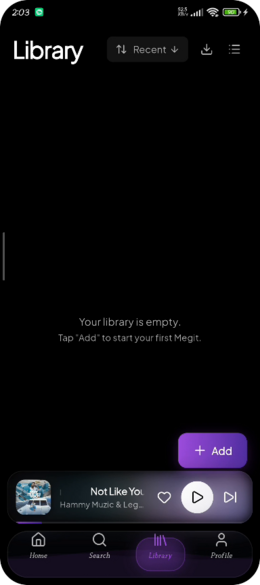
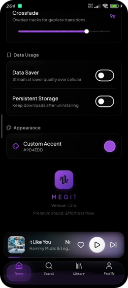
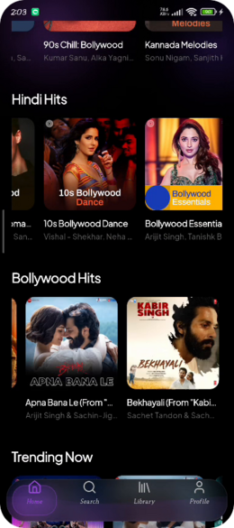

<div align="center">



<h1>Megit</h1>

<p><em>A premium music streaming app — powered by YouTube Music, built with Flutter.</em></p>

[](https://github.com/Reddirector/Megit/releases/download/v3.0/app-release.apk)

<br/>

[](https://flutter.dev)
[](https://dart.dev)
[](https://firebase.google.com)
[](https://android.com)
[](./LICENSE)
[](https://github.com/Reddirector/Megit)

<br/>

[**Features**](#-features) • [**Screenshots**](#-screenshots) • [**Tech Stack**](#%EF%B8%8F-tech-stack) • [**Getting Started**](#-getting-started) • [**Download**](#-download)

</div>

---

<div align="center">

</div>

---

## 📖 About

**Megit** is a fully-featured, cloud-connected music streaming app for Android. It plugs directly into the YouTube Music library — no middleman, no proxy — wrapped in a stunning **glassmorphic dark UI** purpose-built for OLED screens.

Offline downloads, crossfade engine, Spotify playlist imports, smart radio queues, real-time lyrics, cross-device sync, and Wrapped-style listening stats — all **free**, all **open source**, **no ads**.

> **Current version:** v3.0 — includes Google Sign-In fix, Firestore playlist cloud sync, improved offline database, and major stability improvements.

---

## ⬇️ Download

<div align="center">

### [⬇️ &nbsp; Download Megit v3.0 for Android](https://github.com/Reddirector/Megit/releases/download/v3.0/app-release.apk)

*Free · Open Source · No ads · Android 5.0+*

</div>

> **How to install:**
> 1. Tap the download link above
> 2. Open the `.apk` file on your Android device
> 3. Allow **"Install from unknown sources"** if prompted
> 4. Tap **Install** — done!

---

## ✨ Features

### 🎨 Premium UI & Visual Design



- **Glassmorphic Design** — Frosted glass panels, blurred backgrounds, and layered depth across every screen
- **Custom Accent Color** — Pick any color; buttons, sliders, progress bars, and glows all update instantly across the entire app
- **Animated Halo Backgrounds** — Fluid, moving gradient halos on the Login and Player screens
- **OLED Dark Mode** — Pure deep blacks for maximum contrast and battery savings
- **"Whale" Animated Backgrounds** — Subtle motion backgrounds bring key screens to life

<br clear="right"/>

---

### 🏠 Home Feed & Music Discovery



- **Dynamic Home Feed** — Personalized sections including *Hindi Hits*, *Bollywood Hits*, *Trending Now*, *Global Top Songs* — always fresh, even without login
- **Direct YouTube Music Integration** — Access one of the world's largest music catalogs with no proxy, ensuring speed and reliability
- **Smart Search** — Instant suggestions as you type, with results categorized into Songs, Artists, Albums, and Playlists
- **Artist Pages** — Dedicated discography views with top tracks, albums, singles, and subscriber counts

<br clear="right"/>

---

### 🔎 Search



- Instant search with **live suggestions** as you type
- Categorized results: **Songs · Artists · Albums · Playlists**
- Top Result card with one-tap play
- Full song context menu: Add to Queue, Start Mix, Add to Playlist, Download
- Voice search support

<br clear="right"/>

---

### 🎛️ Advanced Playback Engine



| Feature | Details |
|:---|:---|
| 🔊 **Audio Engine** | Built on `just_audio` + `audio_service` for high-fidelity output |
| 🌊 **Crossfade** | Smooth transitions with configurable duration (up to 12 seconds) |
| ⏯️ **Gapless Playback** | Zero-gap continuous listening between tracks |
| 📻 **Smart Radio Queue** | "Start Radio" generates infinite similar-track queue from any song |
| 🔀 **Queue Management** | Drag-to-reorder, swipe-to-remove full queue control |
| 🔒 **Background Playback** | Lock screen controls + notification bar integration |

<br clear="right"/>

---

### 🎤 Real-Time Lyrics



- Full **in-sync lyrics** displayed in the player
- Highlighted active line as the song progresses
- Locally cached for instant loading on repeat listens
- Available for millions of tracks across all languages

<br clear="right"/>

---

### 📚 Library & Playlist Management



- **Cloud-Synced Playlists** — All Megit playlists stored in Firebase Firestore, available on any device
- **Offline Playlist Backup** — Even offline playlists are cloud-backed; reinstall and everything restores automatically
- **Spotify Import** — Paste any Spotify playlist URL; Megit matches every track to YouTube Music
- **YouTube Music Import** — Direct import of any public YTM playlist or album
- **Flexible Library Views** — Toggle Grid / List, sort by Alphabetical or Recently Added

<br clear="right"/>

---

### ⚙️ Settings & Personalization



- **Crossfade Duration** — Slider from 0 to 12 seconds
- **Streaming & Download Quality** — Separate settings for Low / Normal / High
- **Data Saver Mode** — Stream at lower quality over mobile data
- **Persistent Storage** — Downloads survive app uninstalls
- **Custom Accent Picker** — Full color wheel with Saturation and Brightness sliders
- **Multi-Device Sync** — All settings follow you across devices via Firestore

<br clear="right"/>

---

### 👤 Authentication & Profile

- **Dual Auth** — Email/Password and **Google Sign-In** (fully fixed in v3.0)
- **Profile Personalization** — Custom display name and avatar synced via Firestore
- **Listening Dashboard** — Day / Week / Month / Year stats on your profile page

---

### 📊 Megit Wrapped — Listening Stats

- **Real-Time Tracking** — Every second of playback is logged for accurate insights
- **Timeframe Filtering** — Today / This Week / Month / Year / All Time
- **Top 10 Songs** — Ranked by play count and total listening time
- **Top 10 Artists** — Auto-enriched with high-res artist images and browse links
- **Daily Averages** — See exactly how much music you consume per day

---

## 📸 Screenshots

<div align="center">

<table>
  <tr>
    <td align="center"><br/><sub><b>🏠 Home Feed</b></sub></td>
    <td align="center"><br/><sub><b>🔥 Trending & Discovery</b></sub></td>
    <td align="center"><br/><sub><b>🔎 Smart Search</b></sub></td>
  </tr>
  <tr>
    <td align="center"><br/><sub><b>🎛️ Now Playing</b></sub></td>
    <td align="center"><br/><sub><b>🎤 Live Lyrics</b></sub></td>
    <td align="center"><br/><sub><b>📚 Library</b></sub></td>
  </tr>
  <tr>
    <td align="center"><br/><sub><b>⚙️ Settings</b></sub></td>
    <td align="center"><br/><sub><b>🎨 Custom Accent</b></sub></td>
    <td align="center"><br/><sub><b>🌍 Global Top Songs</b></sub></td>
  </tr>
</table>

</div>

---

## 🛠️ Tech Stack

| Layer | Technology |
|:---|:---|
| **Framework** | Flutter 3.x (Dart) |
| **State Management** | Riverpod — reactive, provider-based |
| **Navigation** | GoRouter — deep linking + nested routes |
| **Audio Engine** | `just_audio` + `audio_service` |
| **Backend** | Firebase Auth · Firestore · Analytics |
| **Networking** | Dio with custom interceptors |
| **Local Database** | SQLite via `sqflite` |
| **Music Source** | YouTube Music API (direct, no proxy) |

---

## 🚀 Getting Started

### Prerequisites

- **Flutter SDK** `3.x` → [Install Flutter](https://docs.flutter.dev/get-started/install)
- **Android Studio** or VS Code with Flutter & Dart plugins
- **Android device or emulator** (API 21 / Android 5.0+)
- **Firebase project** → [Firebase Console](https://console.firebase.google.com)

### Installation

```bash
# 1. Clone the repo
git clone https://github.com/Reddirector/Megit.git
cd Megit

# 2. Install dependencies
flutter pub get

# 3. Add Firebase config
# Download google-services.json from Firebase Console
# Place it at: android/app/google-services.json

# 4. Run the app
flutter run
```

### Build Release APK

```bash
flutter build apk --release
# Output: build/app/outputs/flutter-apk/app-release.apk
```

---

## 📋 Changelog

### v3.0 — Latest
- ✅ **Google Sign-In Fix** — Fully resolved OAuth authentication
- ✅ **Cloud Playlist Sync** — Robust Firestore sync and automatic restoration
- ✅ **Improved Local Database** — Updated SQLite schema for metadata-only cloud backup
- ✅ **Performance Improvements** — Stability fixes across discovery and playback

---

## 🤝 Contributing

Contributions, issues, and feature requests are welcome!

1. Fork the repo
2. Create your branch → `git checkout -b feature/your-feature`
3. Commit → `git commit -m "Add your feature"`
4. Push → `git push origin feature/your-feature`
5. Open a Pull Request

---

## 📄 License

Distributed under the **MIT License** — free for personal and commercial use.

---

<div align="center">

**Megit v3.0** · Free · Open Source · No Ads · Android Only

Made with 💜 by [Reddirector](https://github.com/Reddirector)

[](https://github.com/Reddirector/Megit/releases/download/v3.0/app-release.apk)

</div>


Note for me features to be added 
1) iso frendly 
2) add a link for multiple playlist import, apple music import 
3) web app
4) make animation in notification make is smoother and with good ui 
5) To remove song from playlist 